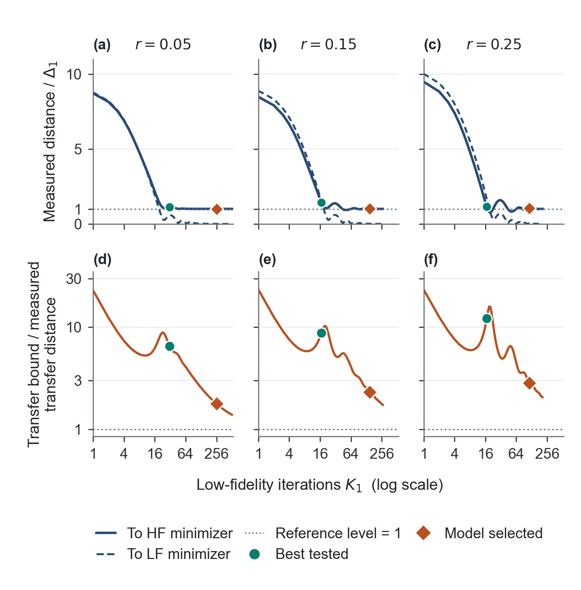

# Cost-aware multi-fidelity iteration allocation

Code, HIGGS data, and reproducible figures for
*Cost-Aware Iteration Allocation for Sequential Multi-Fidelity First-Order Optimization*
by Amir Ardestani-Jaafari, Warren Hare, and Zhongda Huang.
Warren Hare is the corresponding author, warren.hare@ubc.ca.

This page matches the manuscript reviewed on 11 September 2026.

## Current data and code

- [Download the complete reproduction archive](https://github.com/ViggleH/multifidelity-warmstart/releases/download/manuscript-2026-09-11/jogo-reproduction.zip) (27.4 MB).
- [Versioned release and checksums](https://github.com/ViggleH/multifidelity-warmstart/releases/tag/manuscript-2026-09-11).
- [Method-level results](results/publication_methods.csv), 108 records.
- [All tested budgets](results/publication_candidates.csv), 870 records.
- [Grouped results](results/publication_summary.csv) and [overall summaries](results/publication_aggregate.csv).
- [Data dictionary](DATA_DICTIONARY.md) and [archive contents](data/README.md).

The complete archive includes the processed sample, reference data, simulation
source, saved trajectories, tested budgets, current plotting source, and figure
exports. The original [ESM_1.zip](data/ESM_1.zip) is retained for provenance.
Its old results and figure script correspond to an earlier manuscript version.

## Main results

We compare an initial-certificate fixed allocation and online cost comparison
with direct high-fidelity AGD. The best tested fixed budget is a retrospective
reference. All methods use the observed cost `Cost_obs = c1*K1 + c2*K2`, with
`c1 = r`, `c2 = 1`, and completed iteration counts. Certificate checks have no
separate charge.

| Allocation rule | Median regret (%) | Beneficial selections |
| --- | ---: | ---: |
| Initial-certificate fixed allocation | 510.14 | 0/27 |
| Online cost comparison | 10.14 | 27/27 |
| Best tested fixed budget | 0.00 | 27/27 |

Online cost comparison has median direct-to-method cost ratio 1.895. It switches
after 18-66 low-fidelity iterations, compared with 217-1714 for the initial
fixed allocation. Regret is relative to the best tested fixed budget.

## Figure 1. Distance diagnostics


Each column uses one sample ratio for subset seed 11. Upper panels show
distances to the high- and low-fidelity minimizers, divided by their discrepancy.
Lower panels divide the initial/current gradient-certificate transfer bounds
by the measured transfer distance. A value near one indicates a tight bound.
Diamonds and circles mark initial fixed and best tested budgets at epsilon=1e-4.
Reference minimizers are used only for diagnostics.

## Figure 2. Allocation performance



The vertical coordinate is method cost / direct cost, so values below one
improve on direct AGD. Diamonds, triangles, and large circles mark initial
fixed, online, and best tested allocations at epsilon=1e-4. Blue is seed 11;
gray is seeds 12 and 13. [Figure 1 PDF](results/Fig1.pdf) and
[Figure 2 PDF](results/Fig2.pdf) are available as vector graphics.

## Reproduce the current figures and table

Download `jogo-reproduction.zip` from the release into `data/`. Use Python
3.13.9 and the pinned packages below. Arial is used for the published figures.
From the repository root, run

```sh
python -m zipfile -e data/jogo-reproduction.zip output/reproduction
python -m pip install -r output/reproduction/experiments/cost_comparison/requirements.txt
python output/reproduction/figures/make_figures.py
```

This regenerates both figures and the manuscript table from saved data,
without rerunning optimization. Outputs are in `output/reproduction/` and
its `figures/current/` subdirectory. The archive README also gives commands
for a fresh optimization run and explains historical raw cost fields.
The repository's root MATLAB files are the original experiment; use the
Python source inside the current archive for the current allocation comparison.

## Experiment and switching rule

| Setting | Value |
| --- | --- |
| Objective | L2-regularized binary logistic regression |
| High-fidelity sample | 110,000 HIGGS observations, 28 features |
| Regularization | 0.01 |
| Low/high sample ratios r | 0.05, 0.15, 0.25 |
| Accuracy targets epsilon | 1e-3, 1e-4, 1e-5 |
| High-sample seed | 1 |
| Nested subset seeds | 11, 12, 13 |
| Optimizer | Deterministic AGD with varying momentum |
| Observed cost | r*K1 + K2 |
| High-fidelity stopping | squared gradient norm / (2*mu2) <= epsilon |

The fixed rule rounds up the budget computed from the initial gradient
certificate. The online rule recomputes the continuous budget Kstar at every
current iterate and transfers when Kstar <= 4*sqrt(L1/mu1). Low-fidelity
momentum is retained during monitoring, and high-fidelity momentum resets at
transfer. These executable decisions require no reference minimizer.

The 27 comparisons share a high-fidelity sample and were used during rule
development. They are not independent datasets or held-out validation.
The best tested budget is not an optimum over all integer budgets, and search
costs are excluded. The online rule is guided by a continuous sufficient-cost
model; it has no proved optimality guarantee for observed cost.

## Data source and versioning

Daniel Whiteson (2014), [HIGGS, UCI Machine Learning Repository](https://doi.org/10.24432/C5V312),
distributed under [CC BY 4.0](https://creativecommons.org/licenses/by/4.0/).
The supplied sample is stratified and standardized. Source indices and
preprocessing statistics are retained. See [data attribution](data/README.md).
No project-wide software license has been assigned.

Cite version `manuscript-2026-09-11` and its archive SHA-256 digest

```text
a6c5653670f277e47767858291e91d478c18013f704524353824d22cb1719672
```

The complete archive is a release asset. No optimization was rerun for this
publication; the saved numerical values, figure assets, and simulation source
are preserved. [Validation](VALIDATION.md) records the packaging checks.
