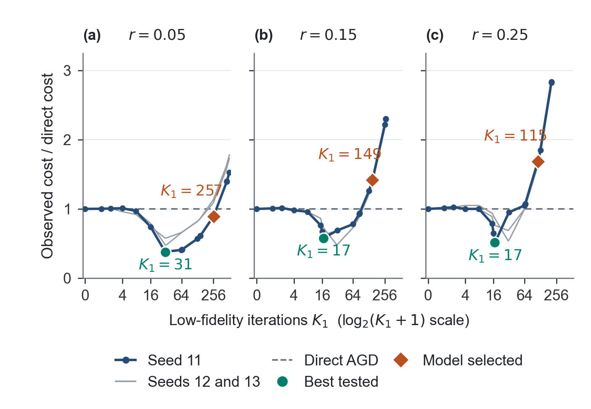

# Cost-aware multi-fidelity warm starts

MATLAB experiment code, archived HIGGS results, and Python diagnostics for
iteration allocation in two-level accelerated gradient descent (AGD).

The study compares an allocation derived from a sufficient-cost bound with
observed optimization work. Suitable warm starts reduce work on this instance,
while the theoretical allocation often spends too long at low fidelity.
The distance diagnostics examine this conservatism.

## Start here

- [Download the complete numerical data archive](data/ESM_1.zip?raw=true) (21.5 MB).
- [Archive contents, attribution, and SHA-256 checksum](data/README.md).
- [Summary data](results/higgs_rq12_summary.csv): medians and ranges across subset seeds.
- [Individual decisions](results/higgs_rq12_decisions.csv): all 27 parameter combinations.
- [Raw evaluated budgets](results/higgs_rq12_raw.csv): 510 budget/target records.
- [Data dictionary](DATA_DICTIONARY.md).

The archive contains the processed sample, full MATLAB results and saved
trajectories, all three CSV tables, a portable figure script, PDF documentation,
metadata, and file checksums. It is the data package prepared for
*Cost-Aware Iteration Allocation for Sequential Multi-Fidelity First-Order Optimization*
by Zhongda Huang, Amir Ardestani-Jaafari, and Warren Hare (corresponding author:
warren.hare@ubc.ca).



## Experiment

| Setting | Value |
| --- | --- |
| Objective | L2-regularized binary logistic regression |
| High-fidelity sample | 110,000 stratified HIGGS observations; 28 features |
| Regularization | 0.01 |
| Low-fidelity ratios | 0.05, 0.15, 0.25 |
| Objective-gap targets | 1e-3, 1e-4, 1e-5 |
| High-sample seed | 1 |
| Nested subset seeds | 11, 12, 13 |
| Optimizer | Deterministic varying-momentum AGD; momentum reset at transfer |
| Work measure | `r * K1 + K2_gap` |
| Experiment code version | `HIGGS_RQ12_20260909` |

These settings define nine low-fidelity objectives and 27 seed/ratio/target
combinations. Features use the high-fidelity sample's mean and sample standard
deviation. Changing the sample ratio changes cost, mismatch, and curvature together.

## Inspect the archived results in MATLAB

Open the downloaded repository as MATLAB's current folder. Extract the archive
once, then use the existing viewer:

```matlab
unzip(fullfile('data', 'ESM_1.zip'), 'results');
view_higgs_results
```

This places the archived MAT files beside the CSV tables and displays the
summary. It does not require the full HIGGS CSV or a new optimization run.
The separately browsable CSVs above are byte-identical to those in the archive.

## Regenerate the manuscript figures

With Python, NumPy, pandas, SciPy, Matplotlib, and Arial installed, run from the
repository root:

```bash
python -m zipfile -e data/ESM_1.zip output/archived_data
python output/archived_data/make_figures.py
```

The script writes Figures 1 and 2 as PDF, EPS, and PNG to
`output/archived_data/regenerated_figures`. It uses the archived measurements
and trajectories, checks cost normalization and distance consistency, and
does not rerun optimization or modify the input data. Both vector figures are
119 mm wide. The archive's `README.pdf` includes the complete data dictionary
and reproduction notes.

The earlier independent audit described in [VALIDATION.md](VALIDATION.md) is
a historical packaging record. Its `analysis/analyze_results.py` source is not
part of this public snapshot; the commands above use the plotting source that
is actually included in the downloadable archive.

## Rerun the full MATLAB experiment

1. Download HIGGS from the [UCI dataset page](https://archive.ics.uci.edu/dataset/280/higgs).
2. Extract the headerless CSV to `data/HIGGS.csv`.
3. Open the repository folder in MATLAB and run:

```matlab
run_higgs_rq12
```

The runner displays the code version, runs the synthetic self-test, and starts
the paper experiment. It scans the full CSV once to construct the stratified
high-fidelity sample, then caches it and saves checkpoints under
`output/higgs_rq12_output`. Repeating the command resumes that run.

For a different CSV location:

```matlab
opts = struct('output_dir', fullfile(pwd, 'output', 'new_run'));
results = generate_higgs_sensitivity_data('E:/datasets/HIGGS.csv', opts);
```

Use a new output directory after changing the settings or source file.
The source CSV path, size, and timestamp are part of the cache signature.
The archived MAT files are for inspection and analysis; copying them into a
new run's output directory will not bypass the original cache checks.
The unchanged experiment generator accepts a CSV, not the distributed sample MAT.

MATLAB is required to run the generator. Its helper functions are included in
the same file; earlier separate solver files are not used. The original MATLAB
release was not recorded, and the public package has not been rerun in MATLAB
in the packaging environment. The Python audit is an independent check of the
supplied experiment, not a claim of MATLAB/Octave compatibility.

## Interpretation

- The continuous theoretical budget minimizes a sufficient-cost model.
  The executable decision compares its neighboring positive integers and direct AGD.
- The empirical benchmark is the best **tested** budget, not the optimum over
  every possible integer budget.
- Speedup is normalized gradient work. Preprocessing, reference solves, the
  offline budget search, and diagnostic evaluations are excluded.
- All tested configurations admit a beneficial warm start, so agreement alone
  does not establish the ability to reject unhelpful warm starts.
- Results describe one data instance with three subset seeds. Accuracy targets
  and subsets share trajectories/data, so they are not independent replications.

## File organization

| Path | Contents |
| --- | --- |
| `generate_higgs_sensitivity_data.m` | Experiment generator and solver helpers |
| `run_higgs_rq12.m` | Portable runner for a new full experiment |
| `view_higgs_results.m` | MATLAB viewer, after extracting the archive as above |
| `data/ESM_1.zip` | Complete numerical archive, sample, trajectories, and plotting source |
| `data/README.md` | Archive documentation and source attribution |
| `results/` | Browsable copies of the three CSVs and current figure previews |
| `DATA_DICTIONARY.md` | Numerical field definitions |
| `SHA256SUMS.txt` | Checksums of tracked files, excluding this checksum list |

## Data source and permissions

HIGGS: Whiteson, D. (2014). *HIGGS* [Dataset]. UCI Machine Learning Repository.
DOI: [10.24432/C5V312](https://doi.org/10.24432/C5V312).
UCI distributes HIGGS under [CC BY 4.0](https://creativecommons.org/licenses/by/4.0/).
The included sample is a stratified and standardized derivative; see
[data/README.md](data/README.md) for the transformation and attribution.
No project-wide software license has been assigned in this initial package.

## Versioned citation

For an exact data citation, use the archive's commit permalink rather than a
moving branch link: open `data/ESM_1.zip` on GitHub and choose its permanent
link. The SHA-256 digest in [data/README.md](data/README.md) identifies this
archive independently of its download location. No optimization was rerun
for this data publication.
